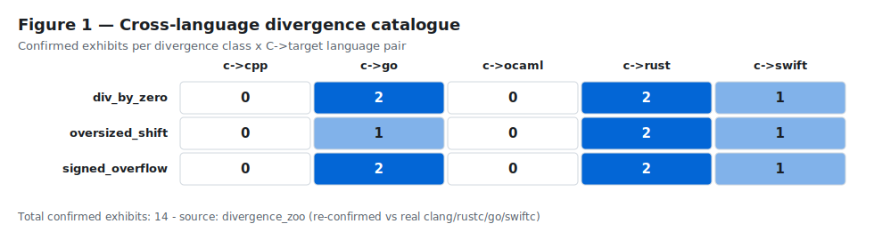
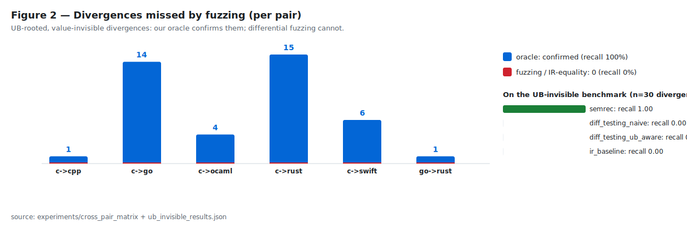
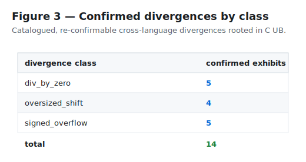

# Paper figures

The three figures a paper is written around, **generated from the real in-repo data** (no plotting dependency; every number is a deterministic function of the live corpora and experiment results and is re-checked by `figures.confirm_figures()`).

## Figure 1 — Cross-language divergence catalogue

## Figure 2 — Divergences missed by fuzzing (per pair)

## Figure 3 — Confirmed divergences by class

## Provenance

| figure | source data |
| --- | --- |
| Fig 1 | `divergence_zoo` (idiomatic + multi-pair corpora, re-confirmed vs real clang/rustc/go/swiftc) |
| Fig 2 | `experiments/cross_pair_matrix/results.json`, `experiments/ub_invisible_results.json` |
| Fig 3 | `divergence_zoo` per-class totals |

Catalogue total: **14** confirmed exhibits across **6** language pairs and **3** divergence classes.
